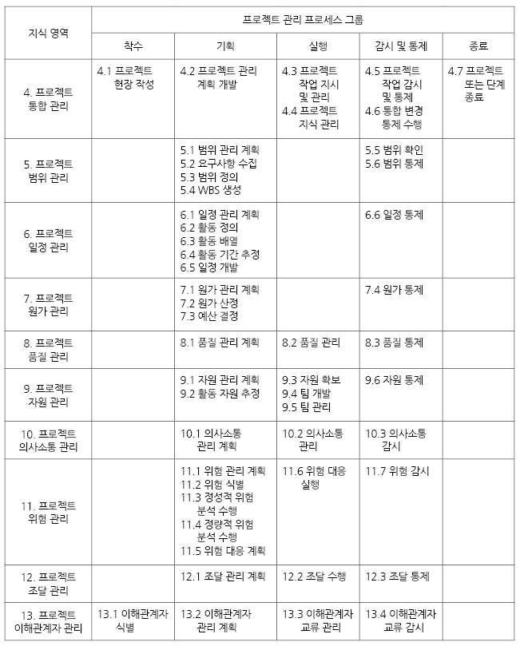
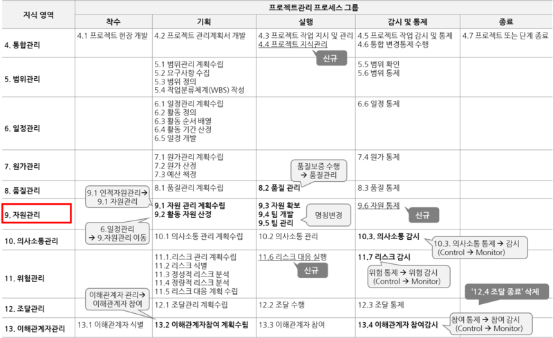

# 프로젝트 관리자의 역할을 잘 수행하려면

## 프로젝트 관리의 출발

### 팀원의 역할

- 분야별 깊이 중요
- Specialist

### 프로젝트 관리자의 역할

- 프로젝트 전반을 파악하고 관리
- 분야별 깊이와 전반적인 분야에 대한 넓이도 중요(T자형 사람)
- Specialist + Generalist

### 프로젝트 관리의 출발

- 프로젝트에 대한 이해, 경험이 충분해야 함
- 프로젝트 결과물에 책임
- 프로젝트 결과물의 전체 측면은 고려하여 팀과 의사소통

## 프로젝트 관리자의 역할

### 역할 및 책임사항 달라짐

- 회사의 절차 및 정책에 따라
- 개별 프로젝트 수행조직 구조에 따라
- 프로젝트에 대한 권한 수준에 따라
- 담당하는 범위에 따라

### 통합자(Integrator)로서의 역할

- 프로젝트 팀 이끌기
- 프로젝트 목표와 이해관계자들의 기대사항을 충족시키기
- 프로젝트 경합하는 제약사항간 균형조절

### 프로젝트 관리 프로세스 및 지식영역의 통합

- 프로젝트 관리 10가지 지식영역 [참고1]

- 프로젝트 관리 49가지 프로세스 [참고2]

- 지식영역 및 프로세스들을 어느 정도의 수준으로 진행할 것인지 통합적으로 고려
- 지식영역 내 프로세스의 상호작용 파악하여 통합 관리

### 서로 상충하는 이해관계의 통합

- 이해관계자의 소속과 지위에 따라 입장차 발생
- 서로 상충하는 이해관계를 통합하기 위해서는 의사소통, 갈등해결, 문제해결, 리더십등의 역량 필요

## 이상적인 프로젝트 관리자의 특징

### 이상적인 프로젝트 관리자

- 비즈니스전문가
- 기술전문가
- 심리전문가
- 오락전문가

### 이상적인 프로젝트 관리자가 되려면

- 프로젝트가 속한 산업에 대한 이해 필요
- 프로젝트에 대한 진지한 열의
- 긍정적이고 적극적인 생각
- 이해관계자의 파악
- 활기찬 팀 내 분위기 유지
- 프로젝트 성공/실패와 인생의 성공/실패를 분리

[참고1]: https://blog.naver.com/renucs/221174044158
[참고2]: https://33cram.tistory.com/115
